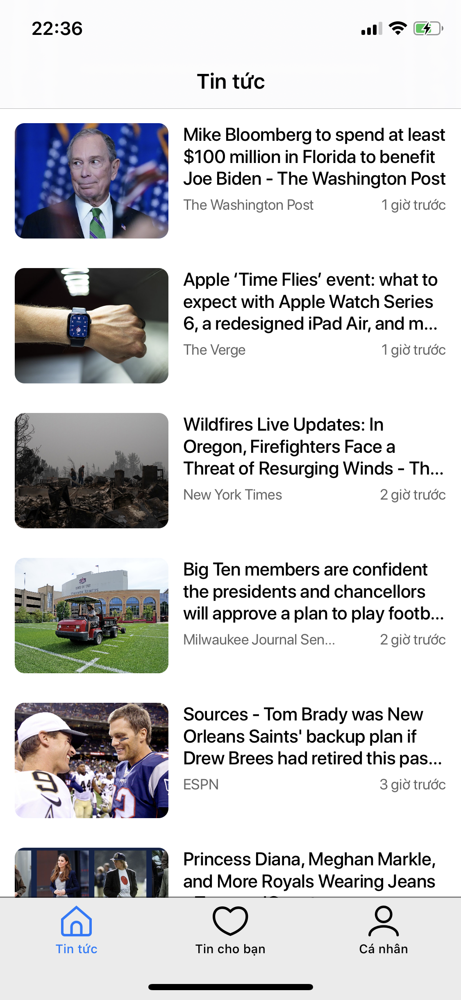

# Tokoin Challenge


##  Prerequisite

 - Xcode 11.6 
 - Swift version 4.2 or later

## Installing

 - cd to project folder
 - run Scripts/install.sh
 

> If something went wrong please try: Scripts/generate.sh and Pod install

## Source code structure

 - Resources: contains Font, Colors, Localize,...  use [SwiftGen](https://github.com/SwiftGen/SwiftGen) generate source code to manage all of these
 - Application: contains AppDelegate and Navigator to coordinate application
 - Modules: contains features such as  Profile, NewsList, NewsDetail,...
 - Domain: contains Model, abstract service,..
 - Data: contains Network layer, Database layer

## ViewModel
```swift
    public protocol ViewModelType {
        associatedtype Input
        associatedtype Output
        func transform(input: Input) -> Output
    }
```
 - View model must conform to ViewModelType
 - Input: View -> ViewModel
 - Output:  ViewModel -> View


## Demo
[Video Demo](https://streamable.com/2junq1)

  
